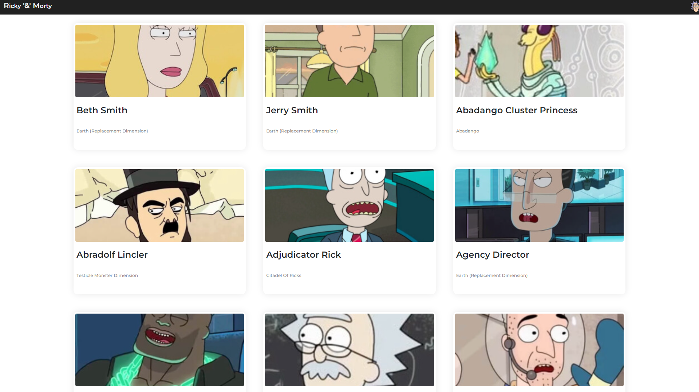

# Ricky and Morty API
The Rick and Morty API is a RESTful and GraphQL API based on the television show Rick and Morty. You will access to data about hundreds of characters, images, locations and episodes. The Rick and Morty API is filled with canonical information as seen on the TV show.
## Ricky and Morty API

